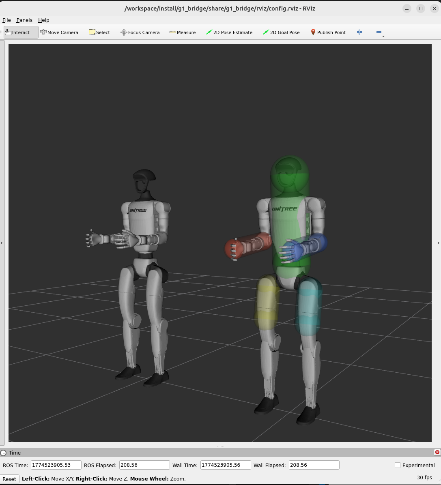

# g1_cbf_ros2

Control Barrier function for the Unitree G1 upper body control.

## Installation and Usage
```
git clone --recurse-submodules https://github.com/Abanesjo/g1_cbf_ros2
cd g1_cbf_ros2
./build_and_run.sh
```

It will build a docker container. This is designed to be used with the [unitree_mujoco](https://github.com/Abanesjo/unitree_mujoco) fork. 

Once in the docker container, run the following commands to interact with the simulation (**tmux** is installed, so use it to create extra windows with ctrl+b quickly): 

### Unitree Bridge
```
ros2 launch g1_bridge g1_bridge.launch.xml
```
**Subscribed Topics**

- /joint_commands
- /lowstate

**Published Topics**

- /lowcmd
- /robot_description

You can edit the `g1_cbf_ros2/g1_cbf/config/params.yaml` file to edit the gains per joint passed into /lowcmd


### Control Barrier Function

```
ros2 launch g1_cbf g1_cbf.launch.xml
```

**Subscribed Topics**

- /joint_commands_unsafe

**Published Topics**

- /joint_commands

Note that the CBF will not publish unless there is input to it. This is designed so that you can stop the robot by stopping the input source


### Joint Control (optional)

If you want to test manually, you can debug / publish joint movements with the following command. 
```
ros2 run joint_state_publisher_gui joint_state_publisher_gui --ros-args -r /joint_states:=/joint_commands_unsafe
```

**Published Topics**

- /joint_commands_unsafe


After the above pipeline is setup, you will see in RViz the two robots like below fully resolve. The one on the left shows the raw control input results, whereas the one on the right is synchronized with the simulation in mujoco and shows the CBF implementation. 


<p align="center">
    
</p>


**Controlled Joints**

The following are the joints whose values are controlled:

- `waist_roll_joint`
- `waist_pitch_joint`
- `left_shoulder_pitch_joint`
- `left_shoulder_roll_joint`
- `left_elbow_joint`
- `right_shoulder_pitch_joint`
- `right_shoulder_roll_joint`
- `right_elbow_joint`
